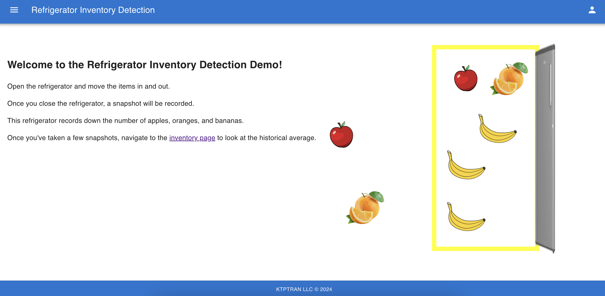
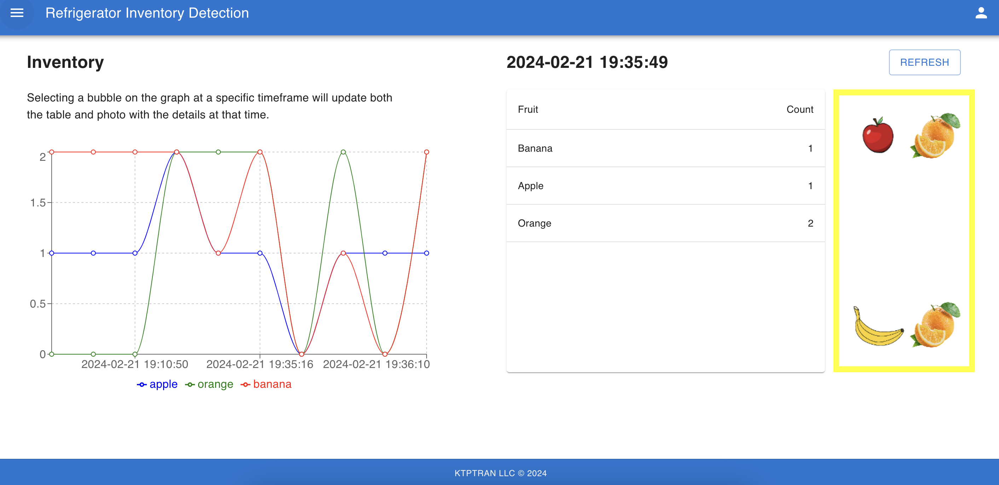
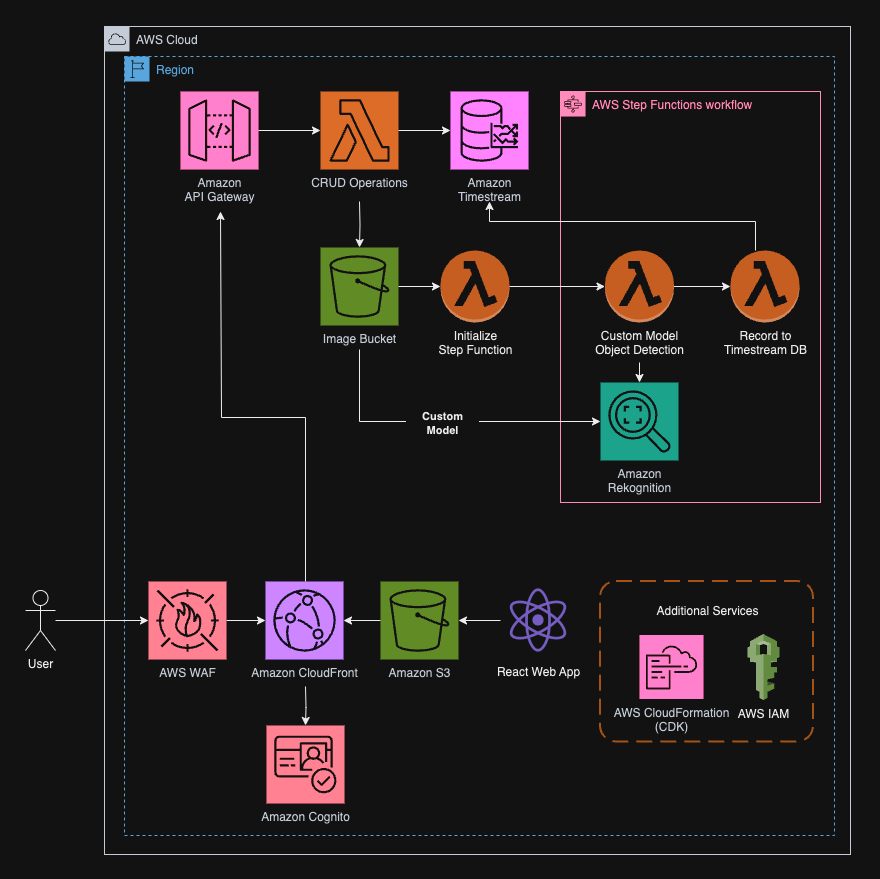

# Inventory Detection Service

## Introduction

Have you ever went to the grocery store and wondered what is in my fridge and what do I have at home?

This project provides a proof of concept view of recording down the inventory automatically using the provisioned resources.

### Objectives and Key Results

1. Provide a platform to automatically record down inventory of items.
2. Provide an interface to view the historical trends.

### Key Performance Indicators (KPIs)

1. Record the inventory within seconds
2. Web platform to view the configuration as needed

## Launch Configurations

### Prerequisites

- python == 3.11
- aws-cli
- aws-cdk >= 2.128.0
- node >= 21.6.1
- npm >= 10.4.0
- http-server >= 14.1.1
- git
- jq >= 1.7.1

### Deployment

Run the following command to build and deploy the inventory detection application. Be sure to setup your AWS account using `aws configure`.

```bash
./scripts/deploy.sh
```

Then run the following command to create a user with a given username and password:

```bash
USER='test'
PASSWORD='ExamplePassword123!'
./scripts/create-user.sh $USER $PASSWORD
```

### Teardown

Once you are finished using the project, use the following command to delete the associated resources.

```bash
./scripts/teardown.sh
```

## Demo

### Recording Inventory

After logging into the system, open the refrigerator and move around the fruits. Once you close the fridge, a snapshot will be saved and analzyed to record.



### Historical View of Inventory

With a few entries, navigate to the inventory page through the sidebar. Here you can view the inventory at any specific time and retrieve its associated image.



## Architecture Overview

### Code Layout

| Path         | Description                                                    |
| :----------- | :------------------------------------------------------------- |
| backend/     | source code for Python backend                                 |
| cdk/         | AWS CDK source code                                            |
| docs/        | Swagger UI documentation of API                                |
| frontend/    | source code for React frontend                                 |
| model-data/  | data for Amazon Rekognition training and test datasets         |
| scripts/     | shell scripts to build, deploy, and interact with the project. |
| docs/assets/ | supporting assets for documentation.                           |

### Architecture Diagram



**Amazon Timestream**

Amazon Timestream is a fast, scalable, serverless managed time series database service for Internet of Things (IoT) and operational applications. Since this is an inventory management system looking at stock over time, Amazon Timestream was a valid option to use.

**Amazon Rekognition**

Amazon Rekognition offers pre-trained and customizable computer vision (CV) capabilities to extract information and insights from your images and videos. This is the main driver for identifying inventory through our trained custom model.

## Future State

### Expanding Scope

This project can be expanded with the following:

1. Rekognition model accuracy = currently there are only 200 images to train the model, but this still produces errors sometimes. Including more images in both the testing and training dataset increases our accuracy. The model images were kept low to save on cost.
2. IoT ingestion = instead of using a web application, using an IoT camera and services such as AWS IoT Core + AWS IoT GreenGrass would scale this further to a full solution.
3. Inventory prediction = Using the historical data we can use Amazon Forecast to help predict the inventory of fruits. This can potentially be used to help predict input of stock for larger applications.

### Optimization and Bugs

The following are implementation bugs for improvements:

1. User state intact when refreshing web console.
2. Authentication / authorization for API gateway and routes
3. AWS WAF for DDoS and SQL injection protection.
4. Teardown script only works if there is only one Rekognition custom model deployed.
