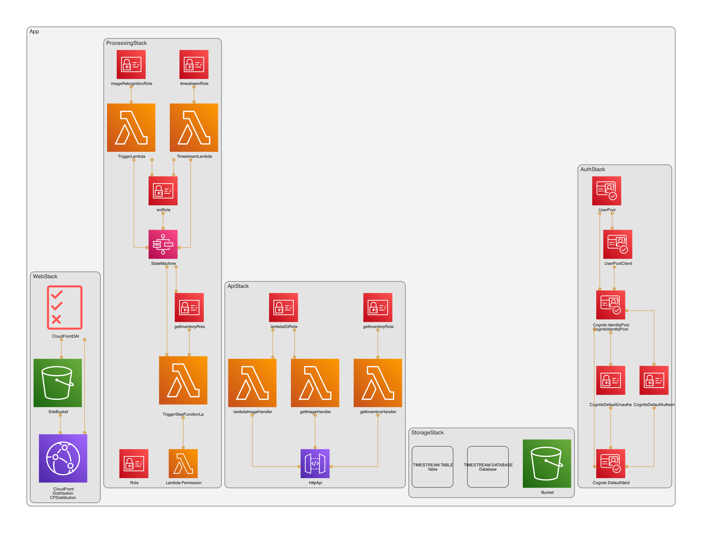

# Welcome to your CDK TypeScript project

This is a project for CDK development with TypeScript. This deploys the associated AWS resources needed for our application to run.

The `cdk.json` file tells the CDK Toolkit how to execute your app.

## Architecture Overview

The following resources are deployed when launching the CDK application.

## Useful commands

- `npm run build` compile typescript to js
- `npm run watch` watch for changes and compile
- `npm run test` perform the jest unit tests
- `npx cdk deploy` deploy this stack to your default AWS account/region
- `npx cdk diff` compare deployed stack with current state
- `npx cdk synth` emits the synthesized CloudFormation template
